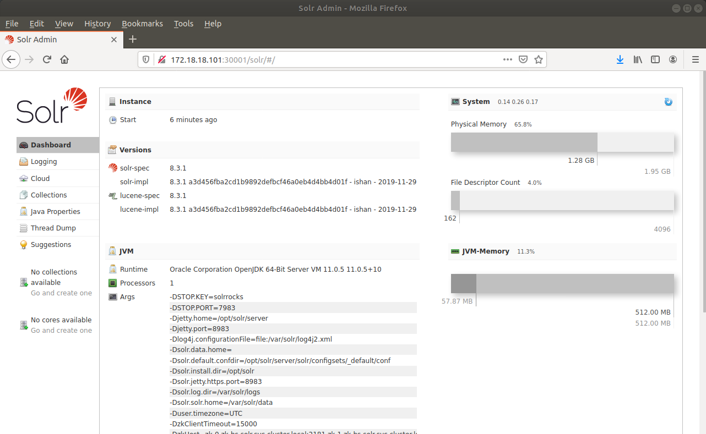
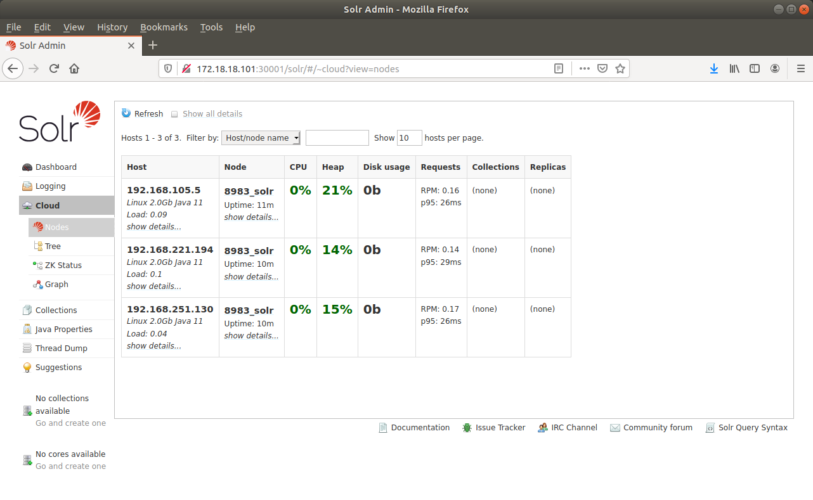
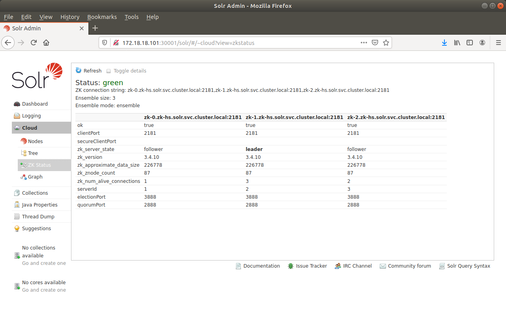

#  [](http://www.yotron.de)

[YOTRON](http://www.yotron.de) is a consultancy company which is focused on DevOps, Cloudmanagement and 
Data Management with NOSQL and SQL-Databases. Visit us on [ www.yotron.de ](http://www.yotron.de)

# Local SolrCloud, Apache Lucene, Kubernetes Cluster
With this project you can create a SOLR/Apache Lucene as a SolrCloud cluster on your local machine. The project based widely on our
other project `local-kubernetes-cluster` (https://github.com/yotron/local-kubernetes-cluster) with which you can create
a Kuberetes cluster from the scratch.

This project attaches a SolrCloud cluster into the Kubernetes Cluster. 

You can start the project with a simple. 

`whoiami@mymachine:~$ vagrant up`
 
The cluster master/nodes will be created  with Vagrant and the provisioning of the master/nodes with Ansible. 
The only additional work is to setup SolrCloud accordingly to your needs.  

All software deployed with the project [local-kubernetes-cluster](https://github.com/yotron/local-kubernetes-cluster) exist in this project as well.
- etcd service as a clustered key/value store (https://etcd.io/), version 3.3.18
- docker-service (https://www.docker.com/), version 19.03.5
- CoreDNS as the DNS server (https://coredns.io/), version 1.6.2
- kubernetes services (https://kubernetes.io/), version 1.17.0
  - kubelet
  - kube-apiserver
  - kube-controller-manager
  - kube-proxy
  - kube-scheduler
  - calico
  - dashboard

Additionally you get the following:
- Zookeeper with a master and three nodes ensemble, version 3.4.10
- SOLR/Apache Lucene in a Cluster with three nodes, version 8.3.1

### Requirements 
- Vagrant (https://www.vagrantup.com/), tested with version 2.2.4
- Oracle Virtual Box (https://www.virtualbox.org/), tested with Version 5.2.34
- Ansible Version (https://www.ansible.com/), tested with Version 2.9.2


### Startup
To start the Cluster an install all necessary components:

`whoiami@mymachine:~$ vagrant up`

The following node will be created:

- *k8s-master*

- *k8s-node-01*

- *k8s-node-02*

- *k8s-node-03*

The start process begins with the Nodes and afterwards the master will be created.

Please be aware that ist tooks some minutes when you start from the scratch till SOLR/Apache Lucene is reachable. 

Here are somme calls for checking the proper setup. 

### Checks

Please check the startup of the nodes and pods of your Kubernetes.

Login to *k8s-master* via Vagrant  :

`whoami@mymachine:~$ vagrant ssh k8s-master`

```
vagrant@k8s-master:~$ kubectl get nodes
NAME            STATUS                     ROLES    AGE     VERSION
172.18.18.101   Ready,SchedulingDisabled   <none>   56m   v1.17.0
172.18.18.102   Ready                      <none>   56m   v1.17.0
172.18.18.103   Ready                      <none>   56m   v1.17.0
172.18.18.104   Ready                      <none>   56m   v1.17.0
```

All pods for Zookeeper and SolrCloud are located in the `solr` namespace of Kubernetes. You get the status of the 
pods with.

```
vagrant@k8s-master:~$ kubectl -n solr get pods
NAME     READY   STATUS    RESTARTS   AGE
solr-0   1/1     Running   2          57m
solr-1   1/1     Running   3          48m
solr-2   1/1     Running   3          45m
zk-0     1/1     Running   2          57m
zk-1     1/1     Running   2          52m
zk-2     1/1     Running   2          49m
```

### Dashboard

The SolrCloud dashboard and interface is available:

`http://172.18.18.101:30001/`



You can see the status of the SolrCloud (cluster) with `Cloud->Nodes`



The status of the Zookeeper ensemble (cluster) you get `Cloud->ZK status`



### Kubernetes

Dashboard URL:

`https://172.18.18.102:30000/`

For the Authentication, please see our GitHub project [local-kubernetes-cluster](https://github.com/yotron/local-kubernetes-cluster)

### Setup of Kubernetes for the SolrCloud and Zookeeper

SolrCloud and Zookeeper are created as a `StatefulSet`. This is the recommended way to setup a cluster in stateful way 
as it is needed for all kind of databases.

In a `StatefulSet` the data persist even with a failure of a node. For that the data node and the operating node is 
separated. In a public cloud environements like AWS you can use as ElasticBlockStorage for example as a data node. On this
 local installation the data is stored on the vagrant machines itself as a `PersistantVolumes` of Kubernetes together with the operating node.
  So please be aware that with the destroying of a vagrant machine, the data is also lost.

The storage sice of the `PersistantVolumes` are 
- Zookeeper: 1 Gb
- SolrCloud: 10 Gb

You can change the setting in `ansible/roles/solr/templates/persistantvolumes.yml` for the `PersistantVolumes` 
and
`ansible/roles/solr/files/solr.yml` and `ansible/roles/solr/files/zookeeper.yml` for the `PersistantVolumesClaim`

### own credentials
You are searching for similar clustered Testenvironments. Don't hesitate to get in touch.

created by [Joern Kleinbub](https://github.com/joernkleinbub), YOTRON, 03.01.2020

Vist me at [LinkedIn](https://www.linkedin.com/in/j%C3%B6rn-kleinbub/) 

Or via EMail <joern.kleinbub@yotron.de>, www.yotron.de